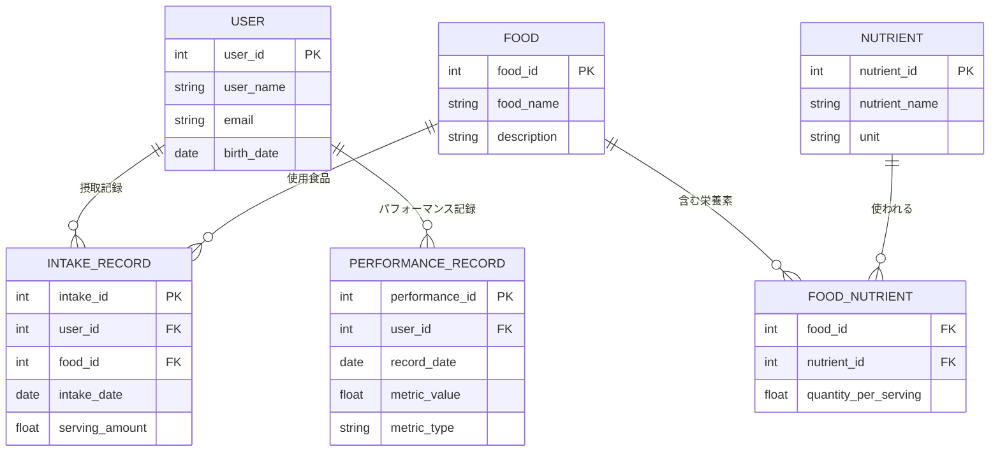

# ER Diagram for NutriPerform

以下は、NutriPerform（仮称）プロジェクトのデータベース設計概要です。摂取した栄養素とパフォーマンス記録を管理するためのエンティティとリレーションシップを示します。

## エンティティの説明

- **USER**: ユーザ情報の管理（ユーザID、氏名、メールアドレス、生年月日）。
- **FOOD**: 摂取する食品の情報。食品名や詳細説明を含む。
- **NUTRIENT**: 栄養素情報。栄養素名や単位（g、mgなど）。
- **FOOD_NUTRIENT**: 食品と栄養素間の多対多のリレーションを解消するブリッジテーブル。サービングごとの栄養素量情報も管理。
- **INTAKE_RECORD**: 各ユーザがどの食品をどの量摂取したかを記録するテーブル。
- **PERFORMANCE_RECORD**: ユーザのパフォーマンス指標（例：体重、走行距離、持久力など）の記録。

このドキュメントを参考にデータベーススキーマやアプリケーション設計を進めてください。 