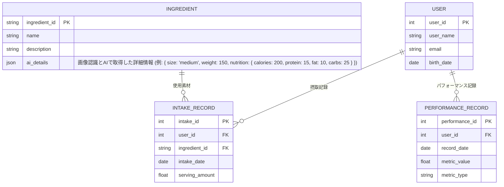

# AIとNoSQLによる動的食材管理アプローチ

本ドキュメントでは、画像から食材や素材（調味料等も含む）を認識し、AIを利用して栄養素や大きさなどの情報を取得する新たな設計方針について記述します。また、データが蓄積されるにつれて、多様な属性を柔軟に扱う必要があるため、NoSQLを利用した設計を採用する考えも取り入れています。

## 背景と課題

従来のリレーショナルデータベースでは、特定のスキーマ（例: FOOD, NUTRIENT, FOOD_NUTRIENT テーブル）に基づいて食品情報や栄養素情報を管理していました。しかし、食材、調味料など様々な素材を扱う場合、各アイテムごとに属性が大きく異なり、固定スキーマでは柔軟性に欠けるという課題があります。また、画像から直接情報を取得する場合、食品の種類やサイズ、重量なども動的に変動するため、従来の設計では対応が難しいという問題もあります。

## 提案する新たなアプローチ

1. **画像認識とAI利用**:
   - ユーザが一枚の画像をアップロードします。この画像には食品や調味料などの素材が配置されており、一般的な規格に基づいたサイズや形状が認識されることを前提とします。
   - バックエンドではOCRやオブジェクト検出アルゴリズム、または外部のAIサービスを利用して、画像から各素材の種類、大きさ、重量、さらには栄養素情報（カロリー、タンパク質、脂質、炭水化物など）を抽出します。

2. **データモデリングの変更**:
   - 従来の `FOOD` テーブルは、より広範な `INGREDIENT`（食材/素材）コレクションに変更します。これにより、食材、調味料、その他の素材を統合して管理できます。
   - 各ドキュメント（例: JSON形式）には、AIによって取得された情報が柔軟に保存され、必要に応じて新たな属性（例: サイズ、重量、栄養素情報など）が追加可能です。
   - この柔軟性を確保するため、NoSQLデータベース（例: MongoDB）の利用を検討します。

3. **システム全体のフロー例**:

   1. ユーザが画像をアップロード。
   2. バックエンドが画像認識AIを呼び出し、画像から各素材の詳細情報を抽出。
   3. 抽出された情報は、NoSQLの `INGREDIENT` コレクションに動的なドキュメントとして保存される。
   4. さらに、ユーザの摂取記録やパフォーマンス記録は、従来通りの `USER`、`INTAKE_RECORD`、`PERFORMANCE_RECORD` として管理され、これらと連携して利用される。

## 更新後のER（概念）図例

以下は、AIによる画像認識とNoSQLを利用した場合の簡略化した概念図例です。

## まとめ

このアプローチにより、画像をもとに動的な情報取得と柔軟なデータ管理が可能となります。従来の固定スキーマに縛られず、多様な素材情報を統合管理することで、データが蓄積されるとともに、利用シーンに応じた柔軟な対応が期待できます。

今後は、具体的な画像認識アルゴリズムの選定およびAIサービスとの連携、さらにNoSQLへの実装方法の検討が求められます。 