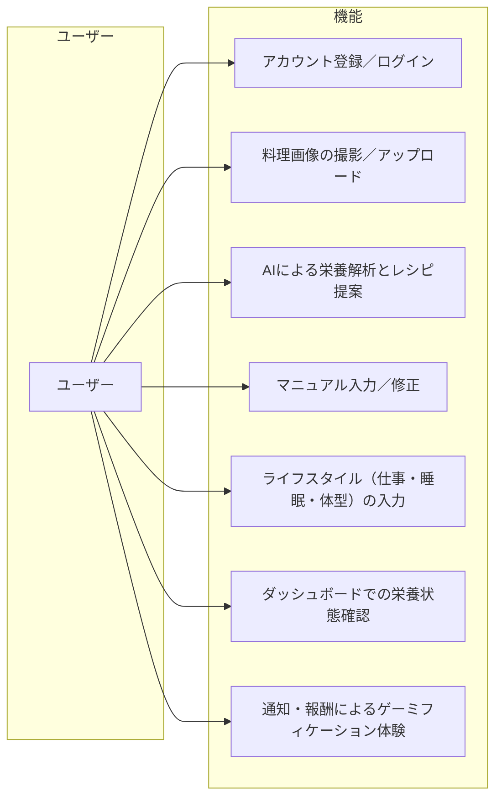
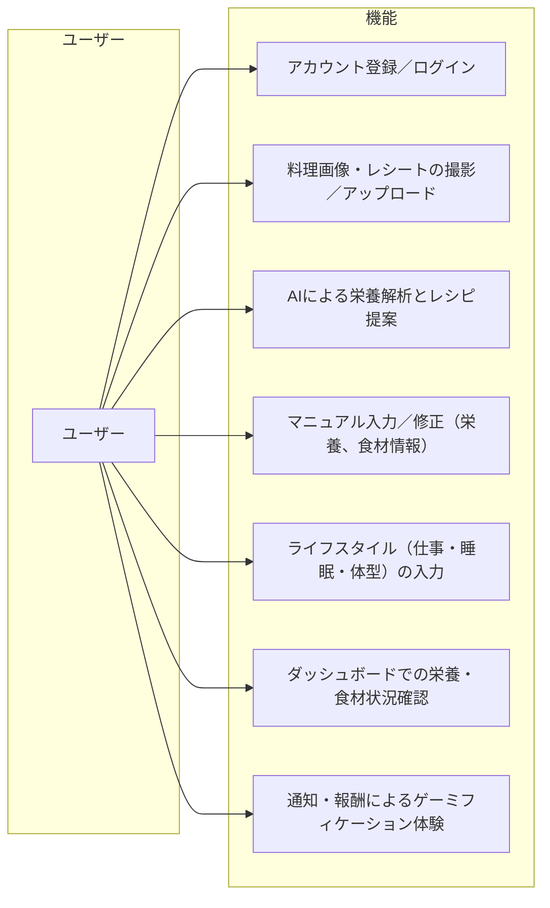

# アプリケーション概要

## 目的

- ユーザーが自分の食生活とライフスタイル（特にリモートワークによる体型の変化や生活リズムの乱れ）を可視化し、必要な栄養素の摂取や健康的な食生活を促す。
- 従来の細かい数値入力ではなく、画像認識や AI によるレシピ提案、そしてマニュアル入力を組み合わせることで、負担の少ない記録方法を提供する。
- ゲーミフィケーションを通じ、ユーザーのマインドセットを「本来必要な栄養素を意識する方向」へシフトさせる。

## ターゲットユーザー

- リモートワーク環境で体型が崩れ、生活習慣が乱れてしまった方

## プラットフォーム

- **PWA（Progressive Web App）**として、デスクトップ・モバイル問わず利用可能

---

# 主な機能要件

## 1. ユーザー管理

- アカウント登録／ログイン（メールアドレス、パスワード、ソーシャルログイン）
- セッション管理（複数ログイン方式を統一した認証システム）

## 2. 栄養摂取記録

### 入力方法

- **画像入力**  
  料理の写真を撮影 →AI が画像認識で大まかな料理情報を抽出し、栄養素（カロリー、P/F/C 等）の概算値を算出
- **レシピ・食材提案**  
  AI が食材やレシピの候補を提案し、提案内容をもとに自動で栄養分析を実施
- **マニュアル入力／補正**  
  AI 認識の抜けや不備がある場合、ユーザーが必要な項目を手動で入力／編集
- **外食時の特殊フラグ**  
  外食メニューの場合、ファントム栄養素（不明確な栄養成分や推定値）を付与

### 記録対象・データ表示

- **記録対象**: すべての栄養素（サプリなどで補給されるアンコモンな栄養素も含む）
- **データ表示／分析**:
  - 栄養素ごとの棒グラフ、円グラフ、全体の栄養記録をチャートで比較
  - 前日に不足していた栄養素の一覧表示と、それを補うレシピ提案

## 3. パフォーマンス記録（ライフスタイル記録）

- 対象データ：自己評価スコア、体重、体脂肪率、睡眠の質などの最低限のメトリクス

## 4. 通知・ゲーミフィケーション

- **通知機能**: 栄養不足、過剰摂取、記録のリマインダー、目標達成時のアラート通知
- **ゲーミフィケーション**: 達成バッジ、ランキング、目標クリア報酬などを通じたモチベーション向上措置と、健康的な食事選択を促す仕組み

## 5. その他

- データ出力／外部連携  
  ※ CSV 出力は未実装、他の健康管理アプリやデバイスとの連携はなし（MVP 段階）

---

# システム基本アーキテクチャ

以下の図は、MVP として想定するシステムの全体構成（概略）です。

```mermaid
flowchart TD
    A[ユーザー] --> B[PWA フロントエンド]
    B --> C[バックエンドAPIサーバー]

    %% バックエンド内の各モジュール
    C --> D[認証サービス]
    C --> E[栄養管理モジュール]
    C --> F[パフォーマンス（ライフスタイル）管理モジュール]
    C --> G[通知・ゲーミフィケーションモジュール]

    %% 栄養管理モジュール内のサブコンポーネント
    E --> E1[画像認識 / AI解析エンジン]
    E --> E2[レシピ・食材提案エンジン]
    E --> E3[マニュアル入力／補正機能]

    %% データベース連携
    C --> H[(データベース)]

    %% 外部連携（ソーシャルログイン）
    D --> I[ソーシャル認証プロバイダー(Google/Facebook等)]
```

ポイント：

PWA フロントエンド： ユーザーが直感的に操作できるインターフェイスを提供
画像認識／AI 解析エンジン： 料理画像から栄養素を推定する AI 機能
レシピ提案エンジン： ユーザーの栄養状態に応じたレシピ・食材の提案を実施
認証サービス： ソーシャルログインを含む多様な認証手段を統合管理
通知・ゲーミフィケーションモジュール： ユーザーへのリアルタイム通知やモチベーションアップの仕組みを提供

# ユースケース図

以下は、ユーザーとシステム間の主要なユースケースを示す図です。



# 次のステップ

詳細設計の詰め：

栄養解析に用いる AI モデルの精度・学習データの仕様
レシピ提案ロジックの具体的なアルゴリズムやデータベースの構造
パフォーマンス記録として、どの具体的な指標（例：体重、睡眠スコア、自己評価など）を記録するかの詳細検討
UI/UX のモックアップ作成：

PWA としてのユーザーインターフェイスのワイヤーフレームや画面遷移図の作成
技術選定とプロトタイピング：

バックエンド・フロントエンドの技術スタックの選定（例：Node.js/Express、React/Vue.js など）
ソーシャルログインや画像認識、通知機能のプロトタイプ検証
ゲーミフィケーションの詳細設計：

具体的な報酬体系、バッジ、チャレンジミッションなどの仕組みの設計
以上が、現時点での MVP 要件の概要と初期アーキテクチャ、ユースケース図となります。
ご確認いただき、追加の要件や修正点、さらに詰めたい項目があればお知らせください。
次のステップとして、UI/UX 設計や各モジュールの詳細仕様書の作成に進めていきましょう。

あなた:
レシピは、足りない栄養ををもとに提案したり、ユーザーが入力済みの食材や調味料をもとに、前日や直近 3 日分を考慮し、栄養が足りないものや飽きのないものを提案。そして、こういう食材や調味料があればこうゆう提案もできるとサポート。さらにレシートや領収書をもとに食材を画像認識し、鮮度は良いものとし、適切に管理されている前提で新鮮なうちに使うようなレシピ提案を。つまり、食材の管理と推奨消費期間も管理、手動で推奨を変更可能。
ChatGPT

Thought about recipe and nutrition suggestions を 4 秒行う
整理と統合

レシピ提案機能を中心に、栄養不足を補う提案や食材の管理、消費期間の提案をできるようにする方針をまとめています。

追加の要件情報を踏まえ、レシピ提案機能および食材管理機能の詳細を以下のように更新・整理しました。

更新されたレシピ提案機能と食材管理の要件

1. レシピ提案機能
   栄養不足に基づく提案

ユーザーの直近の摂取記録（前日または直近 3 日分）を分析し、足りない栄養素を補うためのレシピを自動提案
栄養バランスの視点から、メインの P/F/C だけでなく、微量栄養素も考慮した提案
ユーザー入力済みの食材・調味料情報の活用

ユーザーが既に入力している食材や調味料の在庫状況を参照し、かつ飽きが生じないようなレシピを提案
「この食材や調味料があれば、こういうレシピが可能」といった、提案の根拠を明示するサポート機能を追加
レシート・領収書の画像認識による自動入力

ユーザーがレシートや領収書の写真をアップロードすると、画像認識技術を用いて食材を抽出
抽出された食材は、鮮度が良好であり、適切に管理されている前提で「新鮮なうちに使う」ことを促すレシピ提案に活用 2. 食材管理および推奨消費期間
食材情報の管理

ユーザーが手動または画像認識で入力した食材や調味料情報を一元管理
それぞれの食材に対して、購入日や保存状態、推奨消費期間（賞味期限・消費期限に類似した概念）を登録
推奨消費期間の活用とカスタマイズ

登録された推奨消費期間に基づき、食材の使用期限に近づいている場合は優先的に使うレシピを提案
ユーザーが手動で推奨消費期間を変更・上書きできる機能を用意し、柔軟な管理を可能にする 3. システムアーキテクチャへの組み込み（更新版）
既存のシステムアーキテクチャに以下の要素を追加・拡充します。

```mermaid
flowchart TD
    A[ユーザー] --> B[PWA フロントエンド]
    B --> C[バックエンドAPIサーバー]

    %% バックエンド内の各モジュール
    C --> D[認証サービス]
    C --> E[栄養管理モジュール]
    C --> F[ライフスタイル管理モジュール]
    C --> G[通知・ゲーミフィケーションモジュール]

    %% 栄養管理モジュール内のサブコンポーネント
    E --> E1[画像認識 / AI解析エンジン]
    E --> E2[レシピ・食材提案エンジン]
    E --> E3[マニュアル入力／補正機能]
    E --> E4[食材管理＆推奨消費期間モジュール]

    %% データベース連携
    C --> H[(データベース)]

    %% 外部連携（ソーシャルログイン）
    D --> I[ソーシャル認証プロバイダー(Google/Facebook等)]
```

ポイント：

レシピ・食材提案エンジン（E2）

ユーザーの栄養摂取履歴や不足栄養素、入力済みの食材・調味料情報、さらにレシート・領収書から抽出したデータを統合的に分析し、最適なレシピを提案
過去数日分の記録から「飽きが出ない」提案ロジックを組み込み
食材管理＆推奨消費期間モジュール（E4）

食材の登録、在庫管理、購入日や推奨消費期間の管理を行い、期限が近づくものを優先的にレシピ提案する仕組みを実装
ユーザーが手動で情報の修正や推奨消費期間のカスタマイズが可能 4. ユースケース図（更新版）
以下は、追加された機能を含むユーザーとシステム間の主要なユースケース図です。


