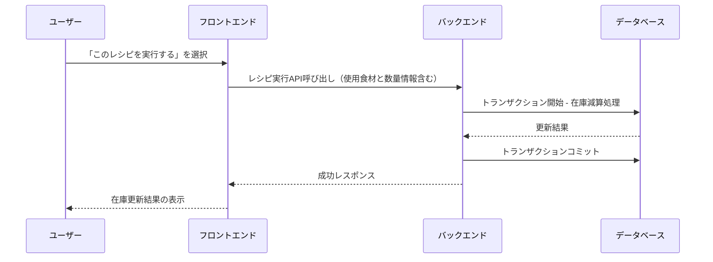

# 詳細設計書

## 1. システム概要

本システムは、以下の機能群を持つ健康支援アプリケーションです。

### 栄養摂取とライフスタイルの管理

- ユーザーが日々の食事、栄養摂取、仕事・睡眠・体型などのライフスタイル情報を記録
- AI を用いた栄養解析やレシピ提案を通じて、健康的な食生活をサポート

### レシピ提案と食材管理

- ユーザーの過去の摂取記録、不足栄養素、在庫情報（特に推奨利用期限に基づく在庫の優先度管理）をもとに、レシピ提案を実施
- 提案段階と実際に「レシピを実行する」際には、使用した食材の在庫が減算される明確なワークフロー

### コミュニティ機能

- インスタグラムのようなビジュアル重視のフィードを提供
- ユーザー（初期は DAU 約 100 を目指す）と AI ボットによる投稿・交流を実現
- ユーザーは、利用済みレシピや栄養価の高い外食情報などを投稿可能
- コミュニティ内での情報共有・発見を促進

### Alpha 機能としての AI 活用

- 画像認識／AI 栄養解析（料理画像、レシート画像からの食材抽出）
- 推奨利用期限の管理（AI が候補を提示する）
- 不確実性の高い機能はアルファ版として提供し、ユーザーフィードバックをもとに改善

### 既製品の管理

- レシピに関係なく、既製品（既に加工済みの食品など）は手動で在庫から除去可能

## 2. システムアーキテクチャ

以下の図は、主要コンポーネントとデータフローを示します。

```mermaid
flowchart TD
    A[ユーザー] --> B[PWAフロントエンド]
    B --> C[バックエンドAPIサーバー]

    %% バックエンド内の各モジュール
    C --> D[認証・ユーザー管理モジュール]
    C --> E[栄養管理モジュール]
    C --> F[レシピ提案モジュール]
    C --> G[食材管理モジュール]
    C --> H[ライフスタイル管理モジュール]
    C --> I[通知・ゲーミフィケーションモジュール]
    C --> J[コミュニティモジュール]

    %% 栄養管理モジュール内のサブコンポーネント
    E --> E1[画像認識 / AI栄養解析 (Alpha)]

    %% レシピ提案モジュール内のサブコンポーネント
    F --> F1[不足栄養分析エンジン]
    F --> F2[ユーザー在庫参照エンジン]
    F --> F3[レシート画像解析 (Alpha)]
    F --> F4[おすすめ食材提案エンジン]

    %% 食材管理モジュール内のサブコンポーネント
    G --> G1[在庫管理]
    G --> G2[推奨利用期限管理 (AIアルファ)]

    C --> K[(データベース)]

    %% 外部連携
    D --> L[ソーシャル認証プロバイダー(Google/Facebook等)]
```

### ポイント

- 各モジュールは、Alpha 機能として提供する部分と、通常運用部分を明確に区分
- コミュニティモジュールでは、AI ボットによる初期投稿支援や、ユーザー投稿のビジュアルフィード（Instagram ライク）を実装

## 3. 各モジュール詳細設計

### 3.1 ユーザー認証・管理モジュール

#### 機能

- メールアドレス・パスワード、ソーシャルログイン（Google、Facebook など）による認証
- ユーザー情報の管理およびセッション管理

### 3.2 栄養管理モジュール

#### 機能

- ユーザーの栄養摂取記録の入力／表示
- 画像認識／AI 栄養解析（Alpha）による料理画像からの栄養素推定
- マニュアル入力／補正によるデータ修正

### 3.3 レシピ提案モジュール

#### 機能

- ユーザーの直近（前日〜直近 3 日）の摂取記録から不足栄養素を分析し、補完レシピを提案
- ユーザーが登録済みの在庫（食材、調味料）を参照し、かつ「よく使う」・「パフォーマンス向上に関連する」食材をおすすめ食材として提案
- レシート・領収書の画像解析（Alpha）により、外食や購入食材を自動抽出し、在庫情報を補完

#### 提案と使用の区分

- **提案**: 栄養・在庫情報に基づいてレシピ候補を表示
- **使用**: ユーザーが「このレシピを実行する」を選択すると、対応する食材の在庫がトランザクション処理により減算される

### 3.4 食材管理モジュール

#### 機能

- 食材・調味料の在庫登録と管理
- 各食材に対する購入日、数量、および推奨利用期限（AI が候補提示するアルファ機能）を管理
- 推奨利用期限が近い食材は自動でハイライトし、一覧の上部へ並び替え
- 既製品（レシピとは無関係に消費済み扱い）の手動削除操作も可能

### 3.5 ライフスタイル管理モジュール

#### 機能

- 仕事、睡眠、体型などのライフスタイルデータの記録と表示
- パフォーマンス指標や自己評価スコアなどの入力項目（拡張可能）

### 3.6 通知・ゲーミフィケーションモジュール

#### 機能

- 栄養不足、在庫の推奨利用期限接近、レシピ実行完了などの通知（プッシュまたはインアプリ通知）
- 達成バッジ、チャレンジ、報酬システムを通じたゲーミフィケーション機能

### 3.7 コミュニティモジュール

#### 機能

- ユーザー投稿のフィード（Instagram ライクのビジュアル重視 UI）
- 初期段階では、DAU 約 100 を目指し、AI ボットが自動投稿を行いコミュニティ活性化を図る

#### 投稿内容例

- 利用したレシピの結果、調理風景、栄養価の高い外食情報
- ハッシュタグやキャプションによる簡易なコメント機能
- ユーザー同士の「いいね」やコメント、シェアなどの基本的なソーシャル機能
- レシピ提案やおすすめ食材の動線と連動し、投稿内で「この食材はパフォーマンス向上に ◎」などの情報もシェア可能

## 4. 推奨利用期限管理およびおすすめ食材の詳細設計

### 4.1 データモデルの拡張

#### FoodInventory テーブル（食材管理テーブル）

| フィールド         | 説明                                                       |
| ------------------ | ---------------------------------------------------------- |
| id                 | 主キー                                                     |
| user_id            | ユーザー ID（外部キー）                                    |
| ingredient_name    | 食材名                                                     |
| quantity           | 在庫数量                                                   |
| purchase_date      | 購入日                                                     |
| recommended_use_by | 推奨利用期限（初期は AI アルファ機能が候補提示）           |
| is_prepackaged     | 既製品フラグ（レシピ関係なく消費済みの場合、手動削除可能） |
| last_updated       | 更新日時                                                   |

### 4.2 推奨利用期限と自動並び替え

#### 処理フロー

1. 在庫リスト取得時、各食材の recommended_use_by と現在日時を比較
2. 残り日数が一定閾値（例：3 日以内）の場合、自動でハイライトおよび上部へソート
3. UI 上に「推奨利用期限が近い」旨のラベルを表示

### 4.3 おすすめ食材提案エンジン

ユーザーの過去の利用履歴やパフォーマンスデータを分析し、以下の食材を提案：

- よく使用する食材
- 健康やパフォーマンスに寄与しそうな食材

これらの情報は、レシピ提案時やコミュニティ投稿の中でおすすめとして提示されます。

## 5. レシピ提案と実行のワークフロー

### 5.1 レシピ提案（Suggestion）

1. ユーザーに対して、過去の記録と在庫情報をもとにレシピ候補を表示
   - 特に推奨利用期限近接
   - 在庫数
   - 推奨食材を考慮
2. この段階では在庫は変更せず、あくまで「提案」として表示

### 5.2 レシピ実行（Execution）

以下のシーケンスで実行されます：



## 6. API 設計（主要エンドポイント例）

### 6.1 レシピ提案取得 API

- エンドポイント: `GET /api/recipes/suggestions`
- パラメータ:
  - ユーザー ID（セッションから取得）
  - 分析対象期間（例：直近 3 日分）
- レスポンス:
  - レシピ候補リスト（各候補に栄養解析結果、在庫情報、推奨食材情報、推奨利用期限近接情報を含む）

### 6.2 レシピ実行 API

- エンドポイント: `POST /api/recipes/execute`
- パラメータ:
  - 選択したレシピ ID
  - 実際に使用する食材と数量（ユーザーが調整可能）
- レスポンス:
  - 在庫更新結果、実行完了メッセージ

### 6.3 コミュニティ投稿 API

- エンドポイント: `POST /api/community/posts`
- パラメータ:
  - 投稿内容（画像、キャプション、ハッシュタグなど）
  - 投稿種別（例：レシピ利用、外食情報など）
- レスポンス:
  - 投稿 ID、投稿日時、投稿成功の確認

### 6.4 AI ボット投稿 API（内部用）

- エンドポイント: `POST /api/community/ai-post`
- 機能:
  - 定期的またはイベントトリガーで、AI ボットがコミュニティへ初期投稿（例：おすすめレシピ、健康ヒントなど）を実施

## 7. UI/UX モックアップ概要

### 7.1 食材管理画面

- 在庫一覧（数量、購入日、推奨利用期限）
- 推奨利用期限が近い食材は自動ハイライト＆上部ソート
- 既製品の手動削除操作、推奨利用期限の手動編集画面

### 7.2 レシピ提案画面

- レシピ候補リスト
  - 各レシピに「提案」としての表示、実行ボタン
  - おすすめ食材情報（パフォーマンス向上・利用頻度高）を表示

### 7.3 コミュニティフィード画面

- インスタグラムライクな画像中心の UI
- ユーザー投稿、AI ボット投稿を混在
- 「いいね」「コメント」などのインタラクション
- 投稿内で、利用したレシピや外食情報が視覚的に伝わるデザイン

### 7.4 通知画面

- 在庫の推奨利用期限接近
- レシピ実行完了
- コミュニティからのリアクション通知など

## 8. Alpha 機能の管理

### 対象機能

- 画像認識／AI 栄養解析（料理画像、レシート画像からの情報抽出）
- 推奨利用期限管理（AI が候補提示する機能）

### 運用方針

- 各 Alpha 機能はフラグ（例：`is_alpha: true`）で管理
- ユーザーに「α 版」としてフィードバックを求める
- 将来的な正式実装への移行を検討
